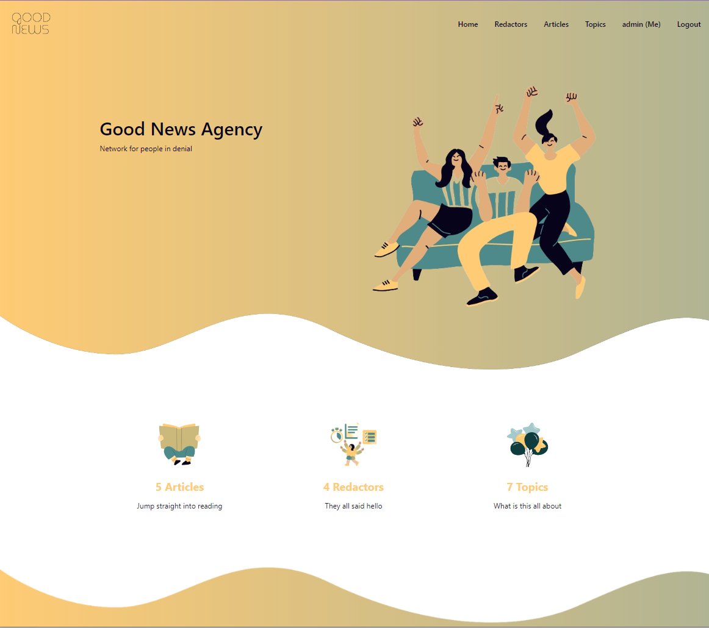
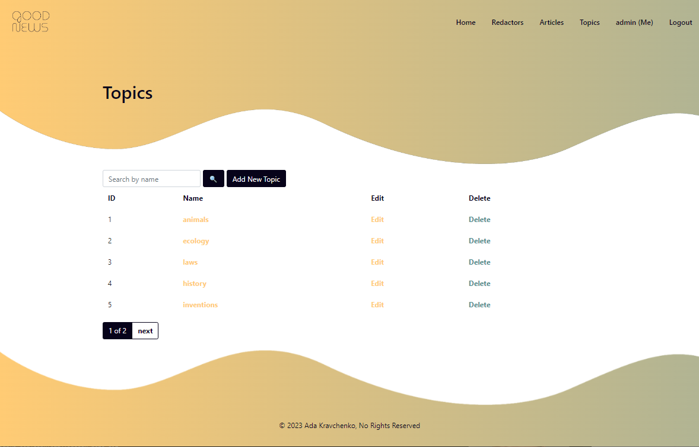

# News Agency Project

Django project for managing articles and redactors in Agency

## Check it out

[Agency project deployed to smthing](ADD_LNK_HERE)

## Installation

Python3 must be already installed

```shell
git clone https://github.com/ada-krav/good-news
cd good-news
python3 -m venv venv
source venv/bin/activate
pip install -r requirements .txt
# starts Django Server
python manage.py runserver #starts Django Server
```

## Features

* Authentication functionality for Redactor/User
* Managing articles, redactors & topics directly from website interface
* Admin panel for additional managing


## Demo


